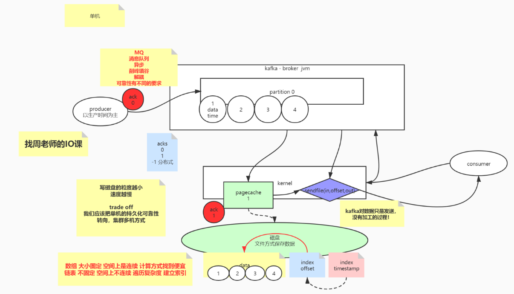

kafka
zookeeper:只是分布式协调
broker:kafka自有的一个角色，可以理解为就像java中jvm，是一个进程(物理进程)
       broker去zookeeper中抢锁，抢到所得就是controller

partition:consumer 
可以是1:1或者N:1
不可以是1:N 会破坏数据有序性

offset
老版本: 在zookeeper的内存中维护了offset(偏移量的进度) 需要持久化
  问题:zookeeper不是存储，对zookeeper不是存储不应该有过多的业务上的调用使用,会占用网卡影响性能
新版本: kafka升级后自己维护offset(在自身创建的一个topic中)
第三方: 也可以在第三方中维护offset,可以是redis,mysql

kafka重复消费
异步:5秒之内先处理数据，然后持久化offset,在处理数据时宕机了还没来得及持久化offset，重启后又拿到之前的offset重新消费了一次

kafka数据丢失
没有控制好顺序，offset持久了，但是业务写失败了

启动：kafka-server-start.sh ./server.properties 

topic: kafka-topics.sh 查看参数选项
创建topic: 
          kafka-topics.sh --create --bootstrap-server localhost:9092 --replication-factor 1 --partitions 1 --topic yjhui
查看topic: 
          kafka-topics.sh --list --bootstrap-server localhost:9092
查看某topic信息：
          kafka-topics.sh --list --bootstrap-server localhost:9092

消费者：kafka-console-consumer.sh 查看参数选项
创建消费者：
         kafka-console-consumer.sh --bootstrap-server localhost:9092 --topic strive --group msb

消费者组：kafka-consumer-groups.sh 查看参数选项
查看消费者组：
           kafka-consumer-groups.sh  --bootstrap-server localhost:9092 --list
查看消费者组详情：
kafka-consumer-groups.sh  --bootstrap-server localhost:9092 --describe --group msb

生产者：kafka-console-producer.sh 
创建生产者：
         kafka-console-producer.sh  --broker-list localhost:9092 --topic strive

当只有一个生产者生产数据的时候，数据会轮询的发个两个分区，一个消费者可以消费多个分区，但是每个分区只能发给一个消费者
比如1个消费者发送数据（1，2,3,4,5,6,7,8）发给两个分区，其中一个分区的数据是（1357），另一个分区是（2468），数据具有有序性
注意：两个消费者应对正在消费两个分区，此时新增一个消费者，因一个分区只能有一个消费者消费，第三个消费者是消费不到数据的

零拷贝
使用系统调用sendfile()直接在内核层面将数据从pageCache中发送给消费者，减少了用户态和内核态的切换

在生产时提供了集中配置
1.acks配置：用来保证发送数据的可靠性
       0：消息发出即完成(在极其追求性能时使用)，没有保证数据的持久化
       1：默认值，消息发出并在磁盘持久化
      -1：分布式，最严苛，所有的副本都要同步（一致）
          例：当有3个broker，1为leader，2和3为follower,当ack=-1时，要求所有的副本同步，当2同步成功3同步失败时，1和2为ISR
              3为OSR

一致性：
1.强一致性： 所有节点必须全部存活，一致性破坏可用性
2-1：最终一致性：过半通过
2-2：
ISR(in-sync replicas) 连通性&活跃性
OSR(outof-sync replicas): 超过阈值时间，没有心跳
AR(Assigned replicas): 面向分区的副本集合,创建topic的时候你给出了分区的副本数，那么controller在创建的时候就已经分配了broker和
                       分区的对应关系，并得到了改分区的broker集合
AR=ISR+OSR