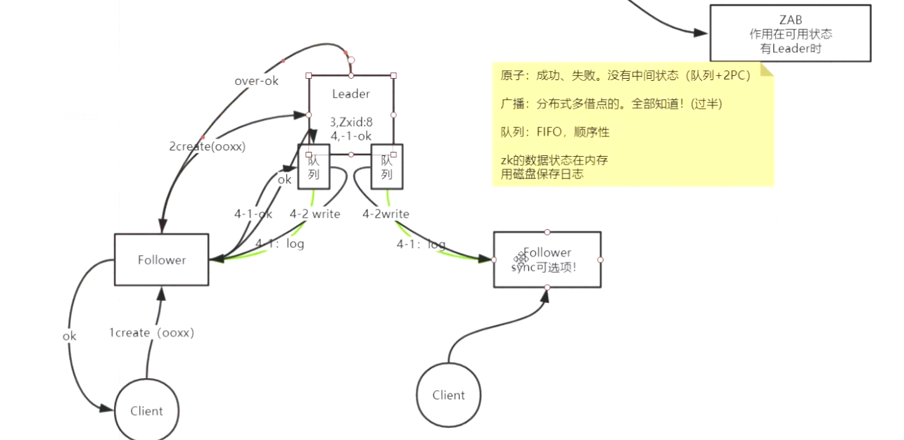

Zookeeper

安装
准备四个节点node01-04
1、安装jdk，并设置javahome
node01：
2、下载zookeeper zookeeper.apache.org
3、解押 tar xf zookeeper.tar.gz
4、mkdir /opt/mashibing
5、mv zookeeper /opt/mashibing
6、vi /etc/profile
a)export ZOOKEEPER_HOME=/opt/mashibing/zookeeper -3.4.6
b)export PATH=$PATH:$ZOOKEEPER_HOME/bin
7、cd zookeeper/conf
8、cp zoo.sem.cfg zoo.cfg
9、vi zoo.cfg
a)dataDir=/var/mashibing/zk
b)server.1=node01:2888:3888
c)server.2=node02:2888:3888
d)server.3=node03:2888:3888
e)server.4=node04:2888:3888
10、mkdir -p /var/mashibing/zk
11、echo 1 > /var/mashibing/zk/myid
12、cd /opt
a)scp -r ./mashibing/ node02:pwd
b)scp -r ./mashibing/ node03:pwd
c)scp -r ./mashibing/ node04:pwd
13、node02-04创建myid
14、启动 1，2，3，4
15、zkServer.sh start-foreground
16、客户端操作
a)zkCli.sh
b)help
c)ls / 查看根目录
d)create /aaa “” 创建节点
e)create -s /aaa/bbb “” 创建序列化节点
f)create -e /aaa/ccc “” 创建临时节点
g)create -s -e /aaa/ddd “” 创建序列化临时节点
h)get /aaa/ccc 查看节点

netstat -natp | egrep  '(2888|3888)'

zkServer.sh status  查看zk状态
zkServer.sh start   启动
zkServer.sh start-foreground :启动会在前台阻塞 日志都会打印出来

1、指令执行时会使用一个唯一递增id
2、cZxid 创建时的id
3、mZxid 修改时的id
4、pZxid 当前节点下创建的最后的id
5、ephemeralOwner 临时持有者
6、临时节点归属于当前session，会话结束前大家都可以访问，会话结束，此节点即刻释放，不能再访问
7、统一配置管理===>每个节点下都有1M的数据
8、分组管理===>path结构，父子节点
9、统一命名===>序列（sequential）
10、同步===>临时节点（ephemeral）
11、分布式锁（依托于临时节点）
12、依托于一个父节点，且统一命名（序列），代表父节点下可以有多把锁
13、队列式事务锁（节点、序列）

Paxos：它是一个基于消息传递的一致性算法
文章：https://www.douban.com/note/208430424/?_i=55837870kVg1_3
ZAB：是Paxos的一个精简版!

两阶段提交：第一阶段写log日志，第二阶段写内存

集群leader选举
1、第一次启动集群和重启集群或者leader挂掉重新选举
2、每个节点有自己的myid和指令id（zxid）
3、新leader选择：
a）经验最丰富，拥有最多的最全的zxid
b）资历最老，myid最大的
c）只有过半通过的才是真数据
4、选举过程：
a）3888造成两两投票
b）只要有人发起投票，都会触发准leader发起自己的投票
c）推选制：先比较zxid，如果都相同再比较myid